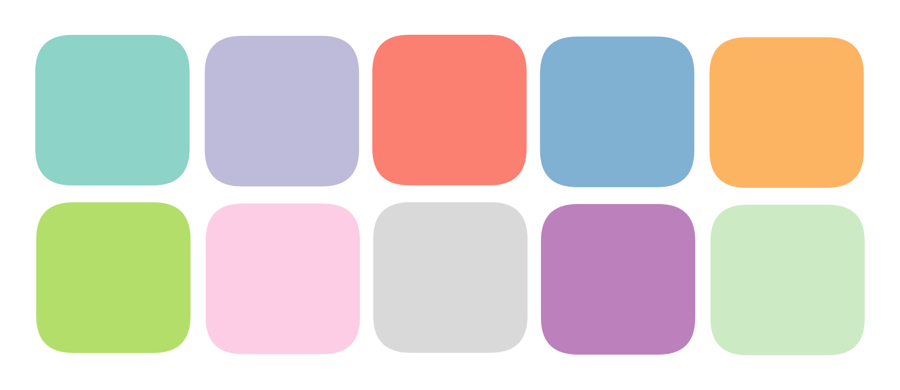

# List of Colors

### List of Colors

A list of colors that can be used with `d3.scaleOrdinal()`. The benefit is that it gives you more colors than stuff like `d3.schemeTableau10`.

```javascript
const colors = [
  "#8dd3c7",
  "#bebada",
  "#fb8072",
  "#80b1d3",
  "#fdb462",
  "#b3de69",
  "#fccde5",
  "#d9d9d9",
  "#bc80bd",
  "#ccebc5",
  "#ffed6f",
  "#1f78b4",
  "#33a02c",
  "#e31a1c",
  "#ff7f00",
  "#6a3d9a",
  "#b15928",
  "#a6cee3",
  "#b2df8a",
  "#fb9a99",
  "#fdbf6f",
];
```

**Note** that I simply used `Github Copilot` to generate these colors. They are not guaranteed to be optimal in terms of Color Theory.



<table><thead><tr><th></th><th></th><th data-hidden></th></tr></thead><tbody><tr><td>turquoise (medium-light)</td><td>#8dd3c7</td><td></td></tr><tr><td>lavender</td><td>#bebada</td><td></td></tr><tr><td>salmon</td><td>#fb8072</td><td></td></tr><tr><td> cyan-blue (medium-light)</td><td>#80b1d3</td><td></td></tr><tr><td>pastel orange</td><td>#fdb462</td><td></td></tr></tbody></table>

### Author

Sam, ytlee@ucdavis.edu

Appended by Arisa, arcowe12@gmail.com
