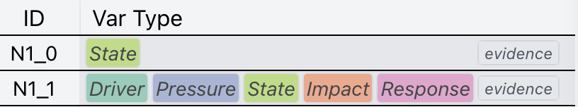

# Adding opacity to RBG Hex

### TL; DR

In some cases I use this function to set opacity on an RGB value that makes it RGBA.

```javascript
/**
 *
 * @param hex color value in rgb hex
 * @param alpha number between 0 and 1
 * @param r_format "rgbaHex" or "rgbHex"
 * @returns
 */
export function setOpacity(hex, alpha, r_format = "rgbaHex") {
  if (r_format === "rgbaHex") {
    return `${hex}${Math.floor(alpha * 255)
      .toString(16)
      .padStart(2, "0")}`;
  } else if (r_format === "rgbHex") {
    return rgbaHexToRgbHex(setOpacity(hex, alpha));
  }
}

/**
 *
 * @param rgbaHex color value in rgba hex
 * @returns color value in rgb hex
 */
export function rgbaHexToRgbHex(rgbaHex) {
  // Remove the hash at the start if it's there
  rgbaHex = rgbaHex.replace(/^#/, "");

  // Parse the hex values
  let r = parseInt(rgbaHex.slice(0, 2), 16);
  let g = parseInt(rgbaHex.slice(2, 4), 16);
  let b = parseInt(rgbaHex.slice(4, 6), 16);
  let a = parseInt(rgbaHex.slice(6, 8), 16) / 255;

  // Calculate the RGB values accounting for the alpha (opacity)
  let rOut = Math.round((1 - a) * 255 + a * r);
  let gOut = Math.round((1 - a) * 255 + a * g);
  let bOut = Math.round((1 - a) * 255 + a * b);

  // Convert the RGB values back to hex
  function componentToHex(c) {
    let hex = c.toString(16);
    return hex.length == 1 ? "0" + hex : hex;
  }

  let rgbHex =
    "#" + componentToHex(rOut) + componentToHex(gOut) + componentToHex(bOut);
  return rgbHex;
}

```

### Exampl Usage

The most common usage of this is if I want **a div to have dynamic color** (often binded to some data).&#x20;

<pre class="language-javascript"><code class="lang-javascript"><strong>// This is svelte code, but similar syntax will work in react, vue, or any other framework
</strong><strong>&#x3C;div style={`background-color: ${setOpacity(someColorScale(some_data), 0.7)}`}>
</strong></code></pre>

<figure><figcaption><p>Example effect: Instead of  svg rects, color is bind to divs for easy layout. <br>Here, there are five categories, each has a categorical color.</p></figcaption></figure>

### Author

Sam, ytlee@ucdavis.edu
