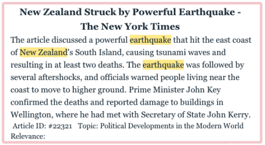

# Text HIghlight

### Text Highlight

The code below shows how to add highlight text like this in HTML: 

#### Code:

```javascript
function add_highlights(raw_text: string, highlights: [number, number][]) {
    if(!highlights || highlights?.length === 0) return raw_text
    let non_highlight_start = 0
    let divided_text: any[] = []
    // values:
    // 0 (normal)
    // 1 (highlight)
    let divided_marks: any[] = []
    highlights.forEach(highlight => {
        const highlight_start = highlight[0]
        const highlight_end = highlight[1]
        // add normal text
        if(non_highlight_start !== highlight_start) {
            divided_text.push(raw_text.substring(non_highlight_start, highlight_start))
            divided_marks.push(0)
        }
        // add highlight
        divided_text.push(raw_text.substring(highlight_start, highlight_end))
        divided_marks.push(1)
        non_highlight_start = highlight_end 
    })
    if(non_highlight_start < raw_text.length) {
        divided_text.push(raw_text.substring(non_highlight_start))
        divided_marks.push(0)
    }
    let res = ""
    divided_text.forEach((sub_text, index) => {
        if(divided_marks[index] === 0)
            res += sub_text
        else
            res += `<span style='background-color:#f4e12c'>${sub_text}</span>`
    })
    return res
}
```

### Usage

It has two parameters, `raw_text`, which is the string to be highlighted, and `highlights`, which is an array of number pairs that represent the start and end index of each highlight, for example:

```javascript
const raw_text = "Hello World should be highlighted"
const highlights = [[0, 5], [6, 11]] 
const highlighted_spans = add_highlights(raw_text, highlights)
```

The return value of `add_highlights` is an HTML string that wraps all the highlighted text inside spans:

```html
<span style='background-color:#f4e12c'> Hello </span>
<span style='background-color:#f4e12c'> World </span>
should be highlighted
```

which you can then use like this in Svelte:

```svelte
<p class="container">
    {@html highlighted_spans}
</p>
```

or in Vue:

```vue
<p class="container" v-html="highlighted_spans"/>
```

### Author

Sam, ytlee@ucdavis.edu
