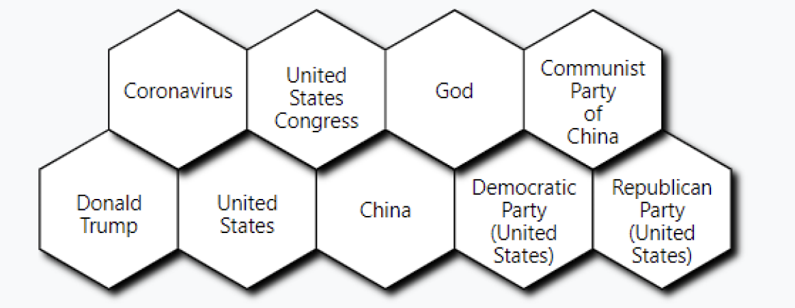
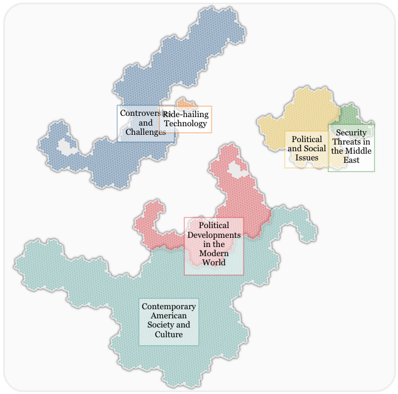

# Text Wrap in svg
`text` tags in svg does not support line break natively.
To add line breaks, one has to wrap multiple `tspan` inside a `text` tag like so:
```html
<text>
    <tspan> first line </tspan>
    <tspan> second line </tspan>
    <tspan> third line </tspan>
</text>
```
In most cases, we want **automatic** line breaks for things like labels or tooltips.
The below function handles this exact requirement:
```javascript
// text longer than `width` will be in next line
function wrap(text, width) {
    text.each(function (d, i) {
        var text = d3.select(this),
            words = text.text().split(/\s+/).reverse(),
            word,
            line: any[] = [],
            lineNumber = 0,
            lineHeight = 1.1, // ems
            x = text.attr("x"),
            y = text.attr("y"),
            dy = 0, //parseFloat(text.attr("dy")),
            tspan = text.text(null)
                .append("tspan")
                .attr("x", x)
                .attr("y", y)
                .attr("dy", dy + "em")
                .attr("text-anchor", "bottom")
                .attr("dominant-baseline", "central")
        while (word = words.pop()) {
            line.push(word);
            tspan.text(line.join(" "));
            if (tspan.node()!.getComputedTextLength() > width && line.length > 1) {
                line.pop();
                tspan.text(line.join(" "));
                line = [word];
                tspan = text.append("tspan")
                    .attr("x", x)
                    .attr("y", y)
                    .attr("dy", ++lineNumber * lineHeight + dy + "em")
                    .attr("dominant-baseline", "central")
                    .text(word);
            }
    }
    const line_num = text.selectAll("tspan").nodes().length
    const em_to_px = 16
    text.selectAll("tspan").attr("y", parseFloat(y) - em_to_px / 2 * lineHeight * (line_num - 1) / 2)
});
}
``` 

An example using this function:
```javascript
svg.selectAll("text")
    .data(data)
    .join("text")
    .attr("pointer-events", "none")
    .attr("x", (d, i) => d.x)
    .attr("y", (d, i) => d.y)
    .attr("text-anchor", "middle")
    .attr("dominant-baseline", "central")
    .text((d) => d)
    .call(wrap, 30)
```

## Example Usages:
### Example 1

### Example 2 
Notice that multiple words could be in the same line



